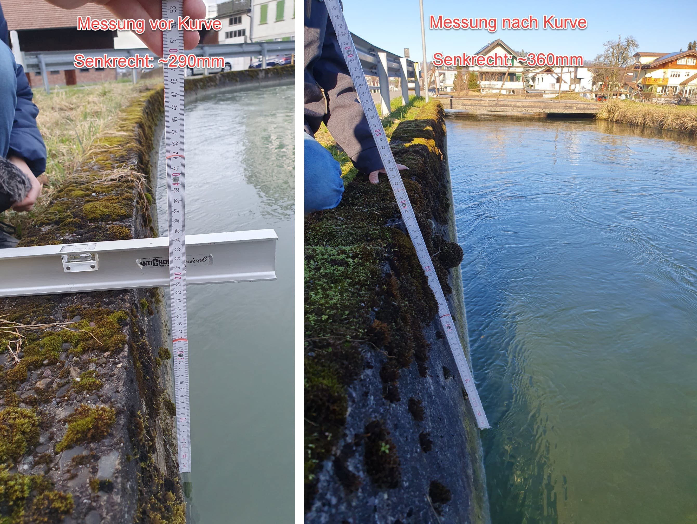
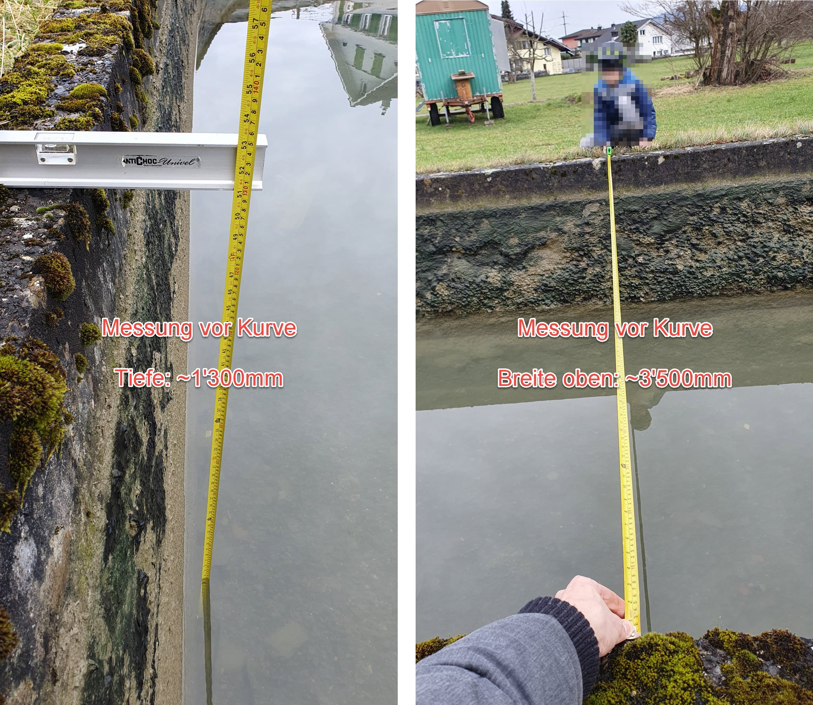
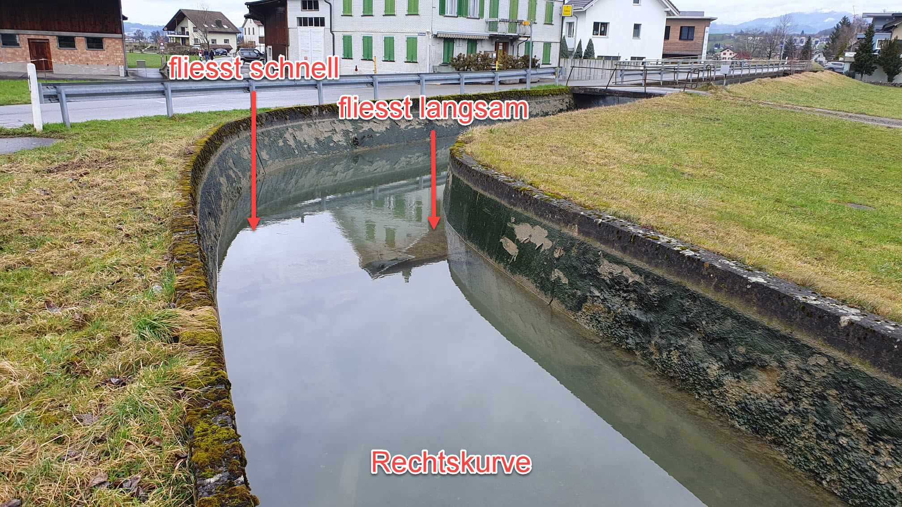
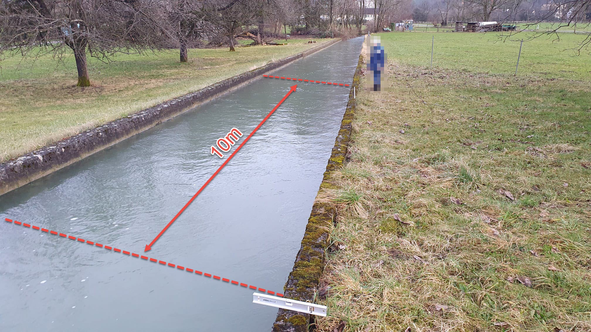

# Wasserrad im Nuolenbach

Bauplan für ein einfaches Wasserrad im Mülibach, respektive [Nuolenbach](https://search.ortsnamen.ch/de/record/16006626).

Inhalt

1. [Typ und Grösse des Rades bestimmen](#1-typ-und-grösse-des-rades-bestimmen)
    1. [Wasserrad-Typ](#11-wasserrad-typ)
    2. [Geometrie des Bachbettes](#12-geometrie-des-bachbettes)
    3. [Fliessgeschwindigkeit des Wassers](#13-fliessgeschwindigkeit-des-wassers)
        1. [Messung der Geschwindigket](#131-messung-der-geschwindigket)
2. [Drehzahl des Wasserrades bestimmen](#2-drehzahl-des-wasserrades-bestimmen)
    1. [Drehzahl berechnen](#21-drehzahl-berechnen)
3. [Konstruktion und Bau](#3-konstruktion-und-bau)

## 1. Typ und Grösse des Rades bestimmen

Das Wasserrad soll so gebaut werden, dass es auf einfache Weise im Bachbett des Nuolenbach montiert werden kann. Zudem soll es genügend Drehmoment liefern, um zwei kleine Treicheln zum Läuten zu bringen. Dabei müssen folgende Punkte beachtet werden:

* 💡 Geometrie und Gegebenheiten des Bachbettes.
* 💡 Je grösser der Durchmesser, je geringer die Drehzahl und je grösser das Drehmoment.
* 💡 Strömungsgeschwindigkeit (Fliessgeschwindigkeit des Wassers). Je schneller die Fliessgeschwindigkeit, je höher die Drehzahl und das Drehmoment des Wasserrades.

### 1.1 Wasserrad-Typ

Es gibt drei Haupttypen von Wasserrädern:

* **Oberschlächtiges Wasserrad:** Das Wasser trifft von oben auf die Schaufeln des Rads und nutzt die Schwerkraft, um es in Bewegung zu setzen.

* **Mittelschlächtiges Wasserrad:** Das Wasser trifft seitlich auf das Rad und erzeugt dadurch Drehmoment.

* **Unterschlächtiges Wasserrad:** Das Rad wird durch den Wasserstrom von unten angetrieben, während es in Bewegung ist.

  

Das unterschlächtige Wasserrad ist der am weitesten verbreitete Rad-Typ. Im Vergleich zum oberschlächtigen und mittelschlächtigen Wasserrad hat es den geringsten Wirkungsgrad, da es sich die Schwerkraft nicht zu Nutze macht. Das Wasser "fällt" nicht nach unten. Dafür braucht es nur einen sehr geringen Höhenunterschied zwischen Ein- und Auslauf.

> ✅ Für das Vorhaben wird ein **Unterschlächtiges Wasserrad** gewählt.

### 1.2 Geometrie des Bachbettes

Auf der [Höhe Restaurant Falken](https://maps.app.goo.gl/M48FYfqZdci4fe548) ist das Bachbett des Nuolenbach betoniert. Der Querschnitt entspricht einem [Trapez](https://de.wikipedia.org/wiki/Trapez_(Geometrie)), bei welchem die obere Grundseite etwas breiter ist.

  
*Der maximale Wasserstand variiert je nach Position zwischen 290 und 360 mm.*

  
*Bachbett vor der Kurve mit einer Breite von 3.5 und einer Tiefe von 1.3 Meter.*

Damit die Schaufeln des Wasserrades tatsächlich ins Wasser eintauchen können, ist ein Radius von mehr als 290 mm erforderlich. Idealerweise sollte er sogar deutlich grösser sein. Denn nicht nur die Schaufel muss ins Wasser eintauchen, auch die Welle kann nicht direkt an der Oberkante des Bachbettes montiert werden, wie in folgender Grafik gezeigt wird.

  
*Bachbett mit einer Breite von 3.5 und einer Tiefe von 1.3 Meter.*

Auf die Fliessgeschwindigkeit des Wassers, welche in der obigen Grafik eingezeichnet ist, wird im nächsten Kapitel eingegangen.

> ✅ Der [Radius](https://de.wikipedia.org/wiki/Radius) des Wasserrades muss **mehr als 290 mm** betragen.

### 1.3 Fliessgeschwindigkeit des Wassers

Neben den geometrischen Gegebenheiten soll auch die Fliessgeschwindigkeit des Wassers berücksichtigt werden. Grundsätzlich kann man festhalten:

* 💡 Das Wasser fliesst in der Mitte schneller als aussen und am Flussboden. Dies weil das Bachbett einen Widerstand darstellt. An den Seitenwänden und am Boden entsteht Reibung, dadurch wird das Wasser abgebremst.
* 💡 In der Aussenkurve ([Prallhang](https://de.wikipedia.org/wiki/Prallhang)) fliesst das Wasser schneller. Da die äussere Seite der Kurve einen grösseren Radius hat als die innere Seite, muss das Wasser an der Aussenseite der Kurve eine grössere Strecke zurücklegen. Um die Kontinuität aufrechtzuerhalten, erhöht das Wasser seine Geschwindigkeit an der äusseren Seite, während es auf der inneren Seite langsamer fliesst.

  
*In der Kurvenaussenseite fliesst das Wasser schneller als innen.*

Auf die Strömung bezogen wäre es am besten, das Rad in der Aussenseite der folgenden Kurve zu montieren. Weil sich die Montage dort jedoch als eher schwierig gestalten würde und weil die Welle extrem lang sein müsste, sodass die Schaufeln das Bachbett nicht touchieren würden, wird davon abgesehen.

  
*Rechtskurve auf der Höhe Mühlestrasse 27 in Siebnen*

> ✅ Trotz der geringeren Strömung am Rand, wird das Rad an einem **geraden Abschnitt vor der Kurve montiert**.

#### 1.3.1 Messung der Geschwindigket

Die Geschwindigkeit des Wassers wird empirisch ermittelt.

Empirisch bedeutet in diesem Fall, dass wir ein Experiment durchgeführt haben, denn errechnen wäre zu schwierig gewesen😉 Gemessen wird die Zeit, welche schwimmendes Laub und Moos benötigt, um eine Strecke von 10 Metern zu überwinden.

  
*Empirische Ermittlung der Geschwindigkeit*

Aus Strecke und Zeit kann anschliessend die Geschwindigkeit errechnet werden. Folgende Messungen wurden am 2. Februar 2024 durchgeführt:

* 14.39 sec für 10 m im ersten Versuch ➡️ **Geschwindigkeit 0.6949 m/s** oder 2.5017 km/h
* 15.44 sec für 10 m im zweiten Versuch ➡️ **Geschwindigkeit 0.6477 m/s** oder 2.3316 km/h

## 2. Drehzahl des Wasserrades bestimmen

Beim idealen Wasserrad ist die Umlaufgeschwindigkeit des Rades gleich der Fliessgeschwindigkeit des Wassers.

Das ist in der Realität natürlich nicht der Fall. Es gibt Reibungsverluste sowie fliesst ein Teil des Wassers rechts und links sowie unten an der Schaufel vorbei. Zusätzlich wird die Schaufel nicht immer im 90°-Winkel angeströmt.

Die Umlaufgeschwindigkeit des Rades (und somit auch die Drehzahl) wird geringer sein als die Geschwindigkeit des fliessenden Wassers.

Dennoch wird im folgenden Beispiel mit den Idealbedingungen gerechnet.

  
*Um die Berechnung zu vereinfachen, wird angenommen, dass die Umlaufgeschwindigkeit des Wasserrades gleich der Fliessgeschwindigkeit des Wassers ist.*

### 2.1 Drehzahl berechnen

Als Taschenrechner dient die kostenloste Open-Source Software [GNU Octave](https://octave.org/), mit welcher folgendes [MATLAB Skript](https://de.wikipedia.org/wiki/Matlab) ausgeführt werden kann.

```matlab
% Clear and close all
clc
clear
close

%-------------------------------------------------------------------------------
% Flussgeschwindigkeit des Baches
%-------------------------------------------------------------------------------
% Am 02.02.2024 wurden 2 Messungen vor Ort gemacht. Es wurde die Zeit gemessen,
% welche schwimmendes Moos für eine Distanz von 10 Metern benötigt.

disp('Geschwindigkeit v [m/s]')
s = 10                      % Strecke [m]
t = 14.39                   % Zeit [s]
v = s/t                     % 0.6949
vKmH = v * 3.6              % 2.5017

%-------------------------------------------------------------------------------
% Drehzahl des idealen Wasserrades
%-------------------------------------------------------------------------------
% Beim idealen Wasserrad ist die Umlaufgeschwindigkeit gleich der Flussge-
% schwindigkeit des Baches. In der Realität wirkt jedoch immer ein Gegenmoment
% auf das Drehmoment, welches vom Wasser erzeugt wird.
%
% Ein teil des Wassers wird fliesst rechts, link und unten an der Schaufel
% vorbei. Ebenfalls gibt es Reibungsverluste von der Mechanik. Zudem wird die
% Schaufel nicht immer im 90° Winkel angeströmt. Deshalb ist die Umlauf-
% Geschwindigkeit langsamer als Flussgeschwindigkeit. Siehe
% https://de.wikipedia.org/wiki/Wasserrad#Leistung_und_Wirkungsgrad

disp('')
disp('Drehzahl n [1/s]')
d = 0.9                     % Durchmesser Wasserrad bei Radschaufelmitte [m]
n = v / (d * pi)            % 0.2458

% Umdrehungen pro Minute. Tendenziell wird s

disp('')
disp('Umdrehungen pro Minute nMin [1/min]')
nMin = n * 60               % 14.747
```

> ✅ Die Berechnung zeigt: Je grösser der Durchmesser, je niedriger die Drehzahl. Bei einem Durchmesser von 900 mm beträgt die errechnete Drehzahl **14.7 Umdrehungen pro Minute**.

## 3. Konstruktion und Bau

ToDo

  
