# Wasserrad im Mühlebachkanal

Dieses Repository beschäftigt sich mit dem Bau eines Wasserrades für den Mühlebachkanal, auch bekannt als [Nuolenbach](https://search.ortsnamen.ch/de/record/16006626), der von Siebnen in den oberen Zürichsee fliesst.

Es werden verschiedene Aspekte des Wasserradbauens behandelt, darunter die Auswahl des Radtyps, die Bestimmung der Grösse basierend auf der Bachgeometrie und der Wasserflussgeschwindigkeit sowie die Konstruktion und der Bau des Rades.

Zur Messung der Drehzahl des Wasserrades wird ein Rundenzähler-Sensor verwendet, der seine Daten an die [The Things Network Cloud](https://www.thethingsnetwork.org/) sendet.

Zudem gibt es eine Webseite mit einem Online-Quiz zum Bach, erreichbar unter [www.nuolenbach.ch](https://www.nuolenbach.ch).

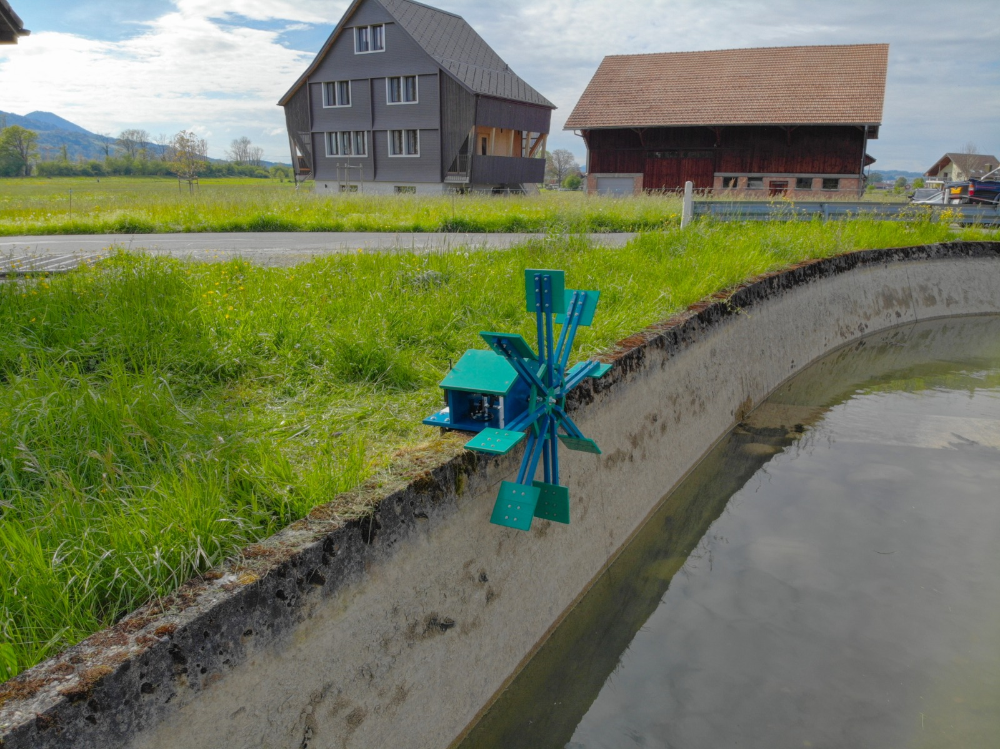
*Das fertig gebaute und im Mühlebach montierte Wasserrad.*

Ein Video auf YouTube zum Wasserrad gibt es [hier](https://youtu.be/QoVuPHz8Htk).

## Inhalt

1. [Typ und Grösse des Rades bestimmen](#1-typ-und-grösse-des-rades-bestimmen)
    1. [Wasserrad-Typ](#11-wasserrad-typ)
    2. [Geometrie des Bachbettes](#12-geometrie-des-bachbettes)
    3. [Fliessgeschwindigkeit des Wassers](#13-fliessgeschwindigkeit-des-wassers)
        1. [Messung der Geschwindigkeit](#131-messung-der-geschwindigkeit)
    4. [Drehzahl des Wasserrades bestimmen](#14-drehzahl-des-wasserrades-bestimmen)
        1. [Drehzahl berechnen](#141-drehzahl-berechnen)
2. [Konstruktion und Bau](#2-konstruktion-und-bau)
3. [Rundenzähler-Sensor](#3-rundenzähler-sensor)
    1. [Dragino SN50v3-LB Sensor konfigurieren](#31-dragino-sn50v3-lb-sensor-konfigurieren)
    2. [The Things Network Cloud](#32-the-things-network-cloud)
    3. [Empfänger des Sensorsignals (Gateway)](#33-empfänger-des-sensorsignals-gateway)
4. [Webseite und Online-Quiz](#4-webseite-und-online-quiz)
5. [Fazit und Ausblick](#5-fazit-und-ausblick)

## 1. Typ und Grösse des Rades bestimmen

Das Wasserrad soll so gebaut werden, dass es auf einfache Weise im Bachbett des Mühlebach montiert werden kann. Zudem soll es genügend Drehmoment liefern, um zwei kleine Treicheln zum Läuten zu bringen. Dabei müssen folgende Punkte beachtet werden:

* 💡 Geometrie und Gegebenheiten des Bachbettes.
* 💡 Je grösser der Durchmesser, je geringer die Drehzahl und je grösser das Drehmoment.
* 💡 Strömungsgeschwindigkeit (Fliessgeschwindigkeit des Wassers). Je schneller die Fliessgeschwindigkeit, je höher die Drehzahl und das Drehmoment des Wasserrades.

### 1.1 Wasserrad-Typ

Es gibt drei Haupttypen von Wasserrädern:

* **Oberschlächtiges Wasserrad:** Das Wasser trifft von oben auf die Schaufeln des Rads und nutzt die Schwerkraft, um es in Bewegung zu setzen.

* **Mittelschlächtiges Wasserrad:** Das Wasser trifft seitlich auf das Rad und erzeugt dadurch Drehmoment.

* **Unterschlächtiges Wasserrad:** Das Rad wird durch den Wasserstrom von unten angetrieben, während es in Bewegung ist.

  

Das unterschlächtige Wasserrad ist der am weitesten verbreitete Rad-Typ. Im Vergleich zum oberschlächtigen und mittelschlächtigen Wasserrad hat es den geringsten Wirkungsgrad, da es sich die Schwerkraft nicht zu Nutze macht. Das Wasser "fällt" nicht nach unten. Dafür braucht es nur einen sehr geringen Höhenunterschied zwischen Ein- und Auslauf.

> ✅ Für das Vorhaben wird ein **Unterschlächtiges Wasserrad** gewählt.

### 1.2 Geometrie des Bachbettes

Auf der [Höhe Restaurant Falken](https://maps.app.goo.gl/M48FYfqZdci4fe548) ist das Bachbett des Mühlebach betoniert. Der Querschnitt entspricht einem [Trapez](https://de.wikipedia.org/wiki/Trapez_(Geometrie)), bei welchem die obere Grundseite etwas breiter ist.

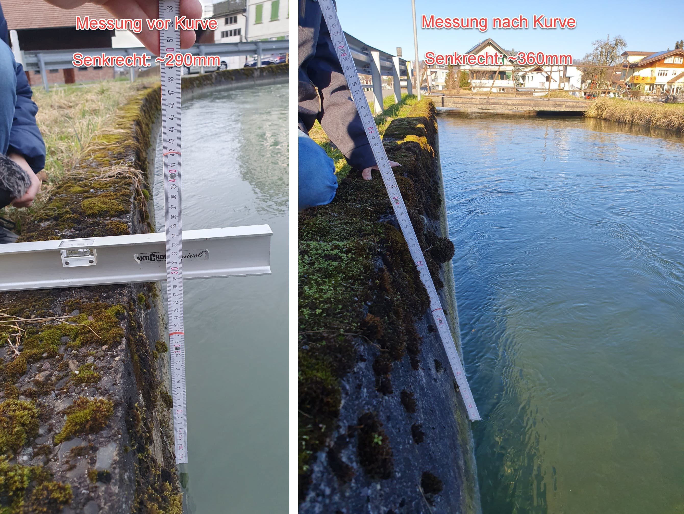  
*Der maximale Wasserstand variiert je nach Position zwischen 290 und 360 mm.*

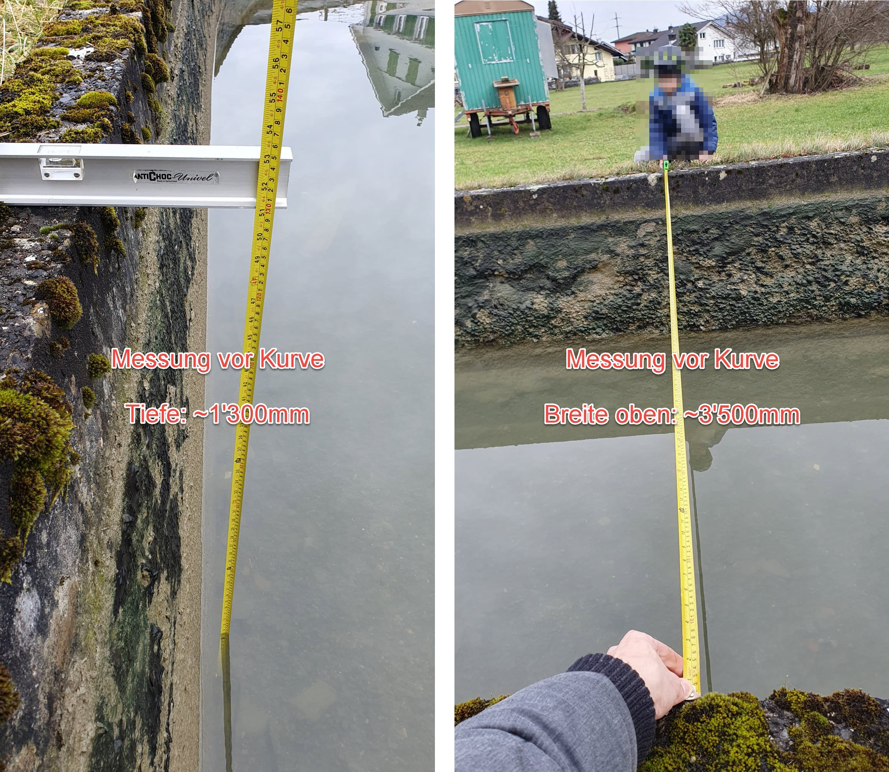  
*Bachbett vor der Kurve mit einer Breite von 3.5 und einer Tiefe von 1.3 Meter.*

Damit die Schaufeln des Wasserrades tatsächlich ins Wasser eintauchen können, ist ein Radius von mehr als 290 mm erforderlich. Idealerweise sollte er sogar deutlich grösser sein. Denn nicht nur die Schaufel muss ins Wasser eintauchen, auch die Welle kann nicht direkt an der Oberkante des Bachbettes montiert werden, wie in folgender Grafik gezeigt wird.

  
*Bachbett mit einer Breite von 3.5 und einer Tiefe von 1.3 Meter.*

Auf die Fliessgeschwindigkeit des Wassers, welche in der obigen Grafik eingezeichnet ist, wird im nächsten Kapitel eingegangen.

> ✅ Der [Radius](https://de.wikipedia.org/wiki/Radius) des Wasserrades muss **mehr als 290 mm** betragen.

### 1.3 Fliessgeschwindigkeit des Wassers

Neben den geometrischen Gegebenheiten soll auch die Fliessgeschwindigkeit des Wassers berücksichtigt werden. Grundsätzlich kann man festhalten:

* 💡 Das Wasser fliesst in der Mitte schneller als aussen und am Flussboden. Dies weil das Bachbett einen Widerstand darstellt. An den Seitenwänden und am Boden entsteht Reibung, dadurch wird das Wasser abgebremst.
* 💡 In der Aussenkurve ([Prallhang](https://de.wikipedia.org/wiki/Prallhang)) fliesst das Wasser schneller. Da die äussere Seite der Kurve einen grösseren Radius hat als die innere Seite, muss das Wasser an der Aussenseite der Kurve eine grössere Strecke zurücklegen. Um die Kontinuität aufrechtzuerhalten, erhöht das Wasser seine Geschwindigkeit an der äusseren Seite, während es auf der inneren Seite langsamer fliesst.

  
*In der Kurvenaussenseite fliesst das Wasser schneller als innen.*

Auf die Strömung bezogen wäre es am besten, das Rad in der Aussenseite der folgenden Kurve zu montieren. Weil sich die Montage dort jedoch als eher schwierig gestalten würde und weil die Welle extrem lang sein müsste, sodass die Schaufeln das Bachbett nicht touchieren würden, wird davon abgesehen.

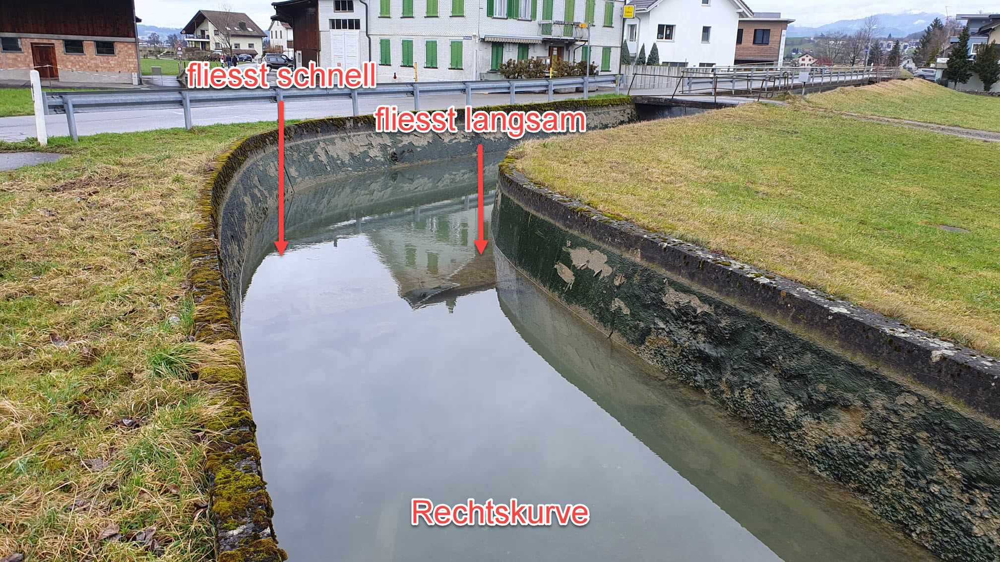  
*Rechtskurve auf der Höhe Mühlestrasse 27 in Siebnen*

> ✅ Trotz der geringeren Strömung am Rand, wird das Rad an einem **geraden Abschnitt vor der Kurve montiert**.

#### 1.3.1 Messung der Geschwindigkeit

Die Geschwindigkeit des Wassers wird empirisch ermittelt.

Empirisch bedeutet in diesem Fall, dass wir ein Experiment durchgeführt haben, um die Geschwindigkeit zu ermitteln. Gemessen wird die Zeit, welche schwimmendes Laub und Moos benötigt, um eine Strecke von 10 Metern zu überwinden.

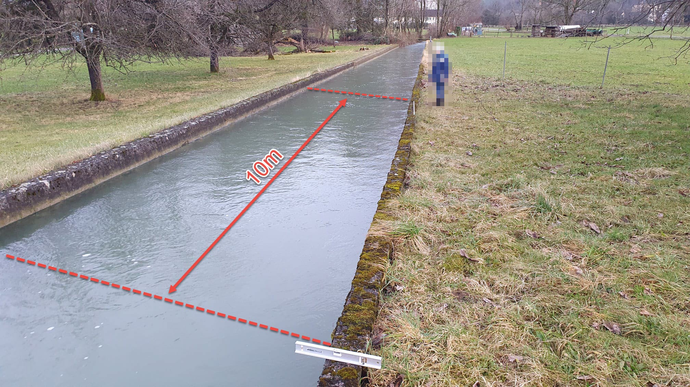  
*Empirische Ermittlung der Geschwindigkeit*

Aus Strecke und Zeit kann anschliessend die Geschwindigkeit errechnet werden. Folgende Messungen wurden am 2. Februar 2024 durchgeführt:

* 14.39 sec für 10 m im ersten Versuch ➡️ **Geschwindigkeit 0.6949 m/s** oder 2.5017 km/h
* 15.44 sec für 10 m im zweiten Versuch ➡️ **Geschwindigkeit 0.6477 m/s** oder 2.3316 km/h

Nachträglich wurde in Erfahrung gebracht, dass pro Sekunde 2.14 m3 Wasser im Mühlebach fliessen. Die Fläche des Bachs im Querschnitt beträgt (Breite x Höhe) 3.4 m x 1.01 m = 3.434 m2. Rechnet man nun die 2.14 Kubikmeter durch die Fläche, erhält man die Distanz, welche das Wasser in einer Sekunde zurücklegt: 2.14 / 3.434 = 0.623 m/s.

> ✅ Die errechnete Geschwindigkeit ist mit 0.623 m/s etwas geringer als die gemessene Geschwindigkeit (0.6477 m/s und 0.6949 m/s).

### 1.4. Drehzahl des Wasserrades bestimmen

Beim idealen Wasserrad ist die Umlaufgeschwindigkeit des Rades gleich der Fliessgeschwindigkeit des Wassers.

Das ist in der Realität natürlich nicht der Fall. Es gibt Reibungsverluste sowie fliesst ein Teil des Wassers rechts und links sowie unten an der Schaufel vorbei. Zusätzlich wird die Schaufel nicht immer im 90°-Winkel angeströmt.

Die Umlaufgeschwindigkeit des Rades (und somit auch die Drehzahl) wird geringer sein als die Geschwindigkeit des fliessenden Wassers.

Dennoch wird im folgenden Beispiel mit den Idealbedingungen gerechnet.

  
*Um die Berechnung zu vereinfachen, wird angenommen, dass die Umlaufgeschwindigkeit des Wasserrades gleich der Fliessgeschwindigkeit des Wassers ist.*

#### 1.4.1 Drehzahl berechnen

Als Taschenrechner dient die kostenlose Open-Source Software [GNU Octave](https://octave.org/), mit welcher folgendes [MATLAB Skript](https://de.wikipedia.org/wiki/Matlab) ausgeführt werden kann.

```matlab
% Clear and close all
clc
clear
close

%-------------------------------------------------------------------------------
% Flussgeschwindigkeit des Baches (empirisch aus Messungen)
%-------------------------------------------------------------------------------
% Am 02.02.2024 wurden 2 Messungen vor Ort gemacht. Es wurde die Zeit gemessen,
% welche schwimmendes Moos für eine Distanz von 10 Metern benötigt.

disp('Geschwindigkeit v [m/s] (empirisch aus Messungen)')
s = 10                        % Strecke [m]
t = 14.39                     % Zeit [s]
v = s/t                       % 0.6949
vKmH = v * 3.6                % 2.5017

%-------------------------------------------------------------------------------
% Flussgeschwindigkeit des Baches (errechnet aus Unterlagen)
%-------------------------------------------------------------------------------
% Gemäss Vertrag mit dem Kraftwerk Wägital von 1925 hatte das EW Wirth einen
% Anspruch auf eine Dotierwassermenge von 2.14 m3/s. Mit dieser Menge wird der
% Kanal nach wie vor betrieben.

disp('')
disp('Geschwindigkeit v [m/s] (errechnet aus Unterlagen)')
b = 3.4                       % Bachbett Breite [m]
h = 1.01                      % Bachbett Höhe Wasserstand [m]
V = 2.14                      % Dotierwassermenge Mühlebach [m3/s]
A = b * h                     % 3.4340
vErrechnet = V / A            % 0.6232
vKmHErrechnet = (V / A) * 3.6 % 2.2434

%-------------------------------------------------------------------------------
% Drehzahl des idealen Wasserrades
%-------------------------------------------------------------------------------
% Beim idealen Wasserrad ist die Umlaufgeschwindigkeit gleich der Flussge-
% schwindigkeit des Baches. In der Realität wirkt jedoch immer ein Gegenmoment
% auf das Drehmoment, welches vom Wasser erzeugt wird.
%
% Ein teil des Wassers wird fliesst rechts, link und unten an der Schaufel
% vorbei. Ebenfalls gibt es Reibungsverluste von der Mechanik. Zudem wird die
% Schaufel nicht immer im 90° Winkel angeströmt. Deshalb ist die Umlauf-
% Geschwindigkeit langsamer als Flussgeschwindigkeit. Siehe
% https://de.wikipedia.org/wiki/Wasserrad#Leistung_und_Wirkungsgrad

disp('')
disp('Drehzahl n [1/s]')
d = 1.05                      % Durchmesser Wasserrad bei Radschaufelmitte [m]
n = vErrechnet / (d * pi)     % 0.1889

% Umdrehungen pro Minute

disp('')
disp('Umdrehungen pro Minute nMin [1/min]')
nMin = n * 60                 % 11.335
```

> ✅ Die Berechnung zeigt: Je grösser der Durchmesser, je niedriger die Drehzahl. Bei einem Durchmesser von 1'050 mm beträgt die errechnete Drehzahl **11.3 Umdrehungen pro Minute**. Nach Inbetriebnahme des Wasserrades zeigte sich, dass die reelle Drehzahl bei nur **7.8 Umdrehungen pro Minute** liegt.

## 2. Konstruktion und Bau

Bei der Konstruktion des Wasserrades wurde ein nicht-traditioneller Ansatz gewählt. Anstatt sofort mit den technischen Zeichnungen zu beginnen, wurde zuerst im Baumarkt nach passendem Holz und Inspiration gesucht.

Nachdem man eine klare Vorstellung davon hatte, welche Materialien verwendet werden sollten, wurden 2D-Skizzen angefertigt, um die Ideen festzuhalten. Dabei wurde auf das kostenlose Tool [Draw.io](https://draw.io/) zurückgegriffen.


*Das Wasserrad von Vorne. Bei der Beschaffung des Holzes wurde mehrheitlich auf die Restholz-Kiste der Zuschnitt-Abteilung im Hornbach Galgenen zurückgegriffen.*


*Das Gehäuse, welches am Bachbett befestigt wird, beherbergt zwei Glocken und den Sensor, welcher die Drehzahl misst.*

Während des Bauprozesses stellte sich heraus, dass einige Teile des Wasserrades mithilfe von 3D-Druck hergestellt werden mussten.

Daher wurde von den ursprünglichen 2D-Skizzen zur 3D-Modellierungsumgebung [Fusion 360](https://www.autodesk.com/products/fusion-360/personal) gewechselt, welche für den persönlichen Gebrauch kostenlos genutzt werden darf. Dieses [3D-CAD](https://de.wikipedia.org/wiki/CAD) ermöglichte es, die benötigten Teile für den 3D-Druck zu entwerfen und gleichzeitig eine umfassendere Darstellung des gesamten Projekts zu erhalten.

Das 3D-Modell kann [hier](https://a360.co/48MgMsR) online angesehen werden. [Hier](./docs/3d-files/Wasserrad_v41.f3d) kann man es als `*.f3d`File  für Fusion 360 herunterladen.


*Wasserrad im 3D-Modell, gezeichnet mit Autodesk Fusion 360.*


*Glocken- und Sensor-Aufhängung. Die Kunststoffteile wurden mittels 3D-Druck gefertigt.*

Die beiden Glocken haben genau die richtige Grösse: Sie sind nicht zu laut, aber laut genug, um vorbeigehende Fussgänger auf das Wasserrad aufmerksam zu machen.

Um das Wasserrad witterungsbeständig zu machen, wurde das Holz mit grüner und blauer Farbe besprüht sowie mit einem Bootslack überzogen.

Insgesamt war diese iterative Vorgehensweise äusserst hilfreich, da sie ermöglichte, flexibel auf neue Anforderungen zu reagieren und gleichzeitig sicherzustellen, dass das Wasserradprojekt sowohl funktional als auch ästhetisch ansprechend daherkommt.

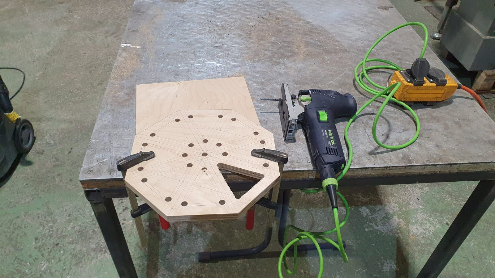
*Die Sperrholzplatten werden mittels Stichsäge bearbeitet.*

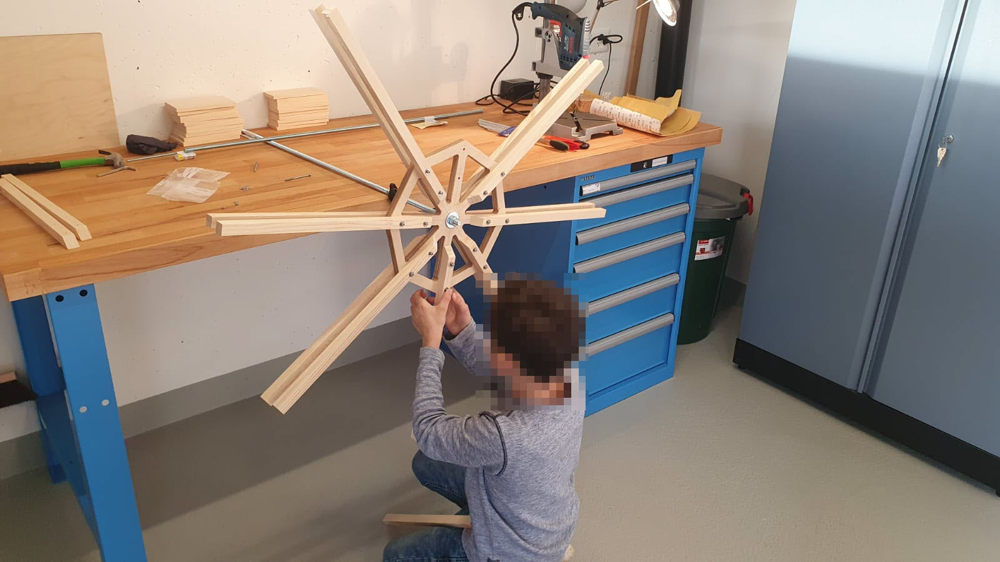
*Alle Teile werden provisorisch zusammengebaut. Dabei wird geprüft, ob alles funktioniert und passt.*

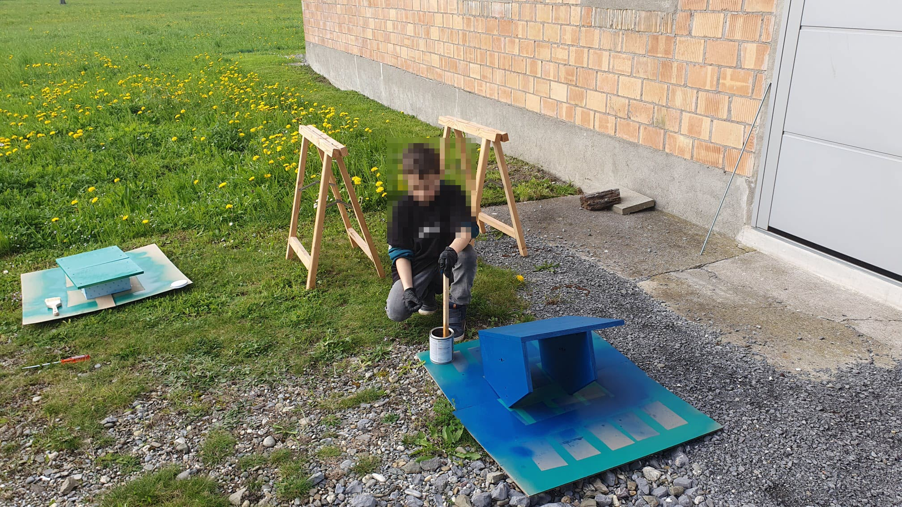
*Die Oberfläche wurde in einem ersten Schritt gespritz und danach mit einem Bootslack überzogen.*

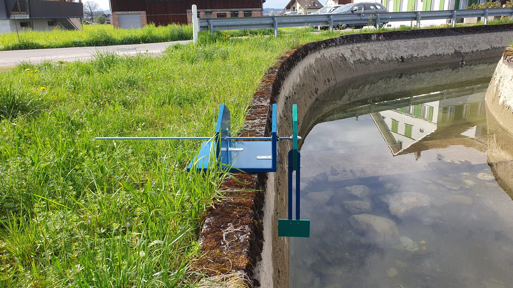
*Probemontage im Mühlebach. Die Höhe passt.*

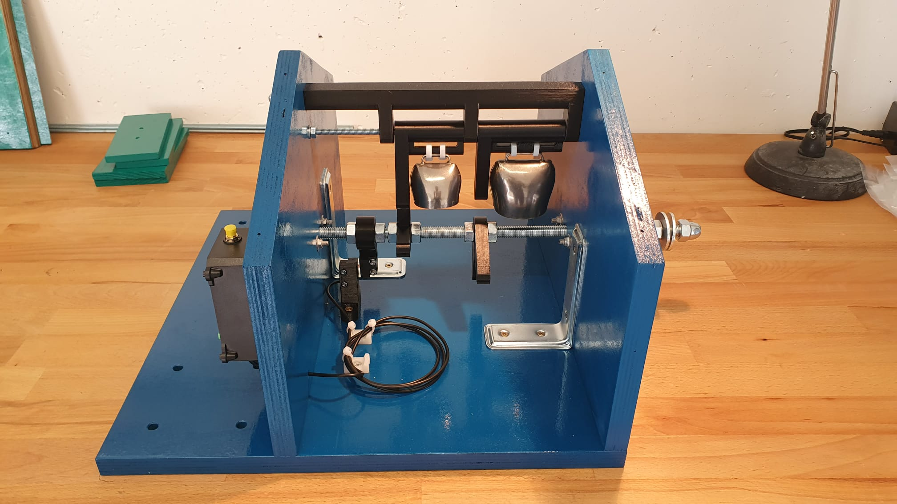
*Montage des Gehäuses mit LoRaWAN-Node und Magnetschalter zur Drehzahlmessung sowie zwei Glocken.*

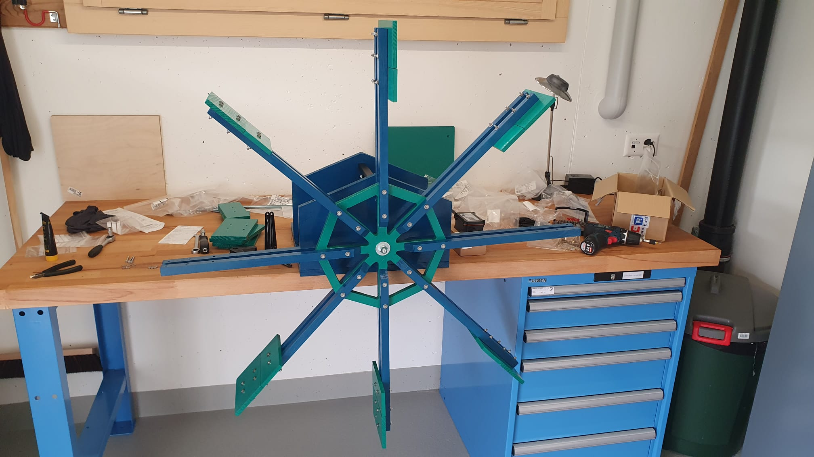
*Montage des Rades mittels M12 Gewindestange.*

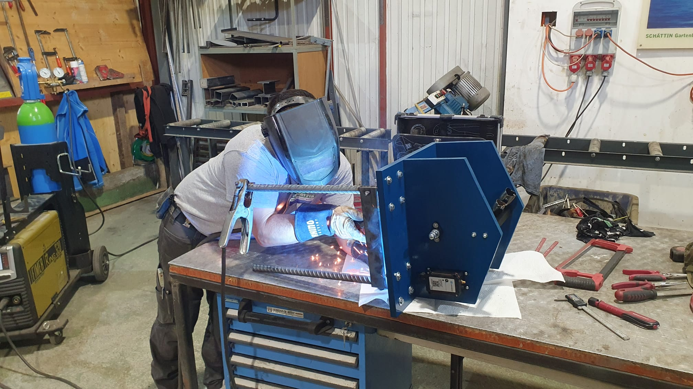
*Schweissen der Halterung für das Wasserrad. Sie wird im Erdboden eingesteckt, sodass das Bachbett nicht beschädigt wird.*

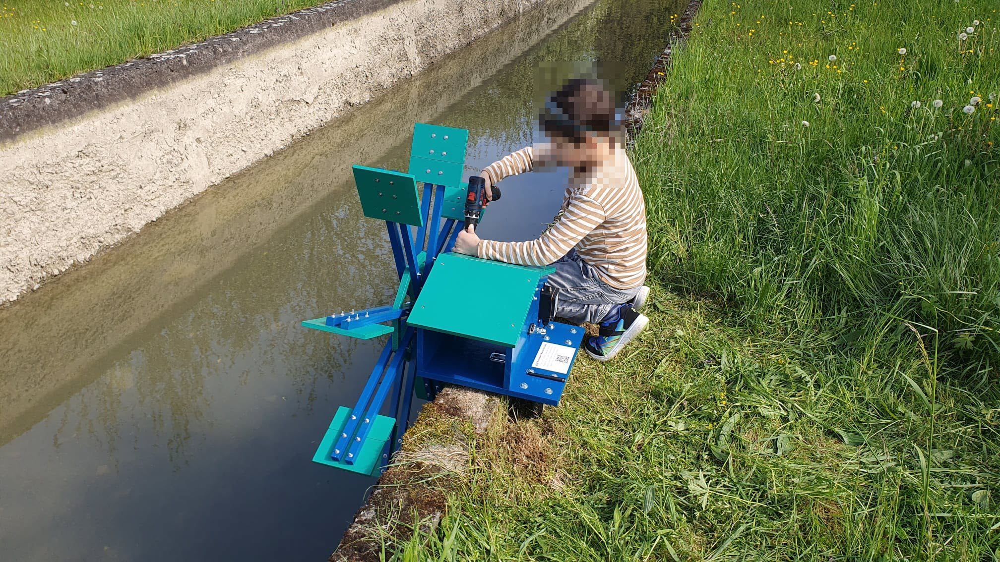
*Inbetriebnahme des Wasserrades am 26. April 2024.*

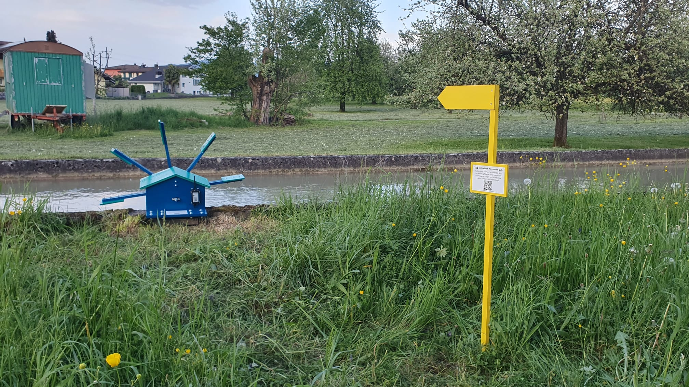
*Nachträglich montierter Wegweiser, sodass Spaziergänger und Besucher den QR-Code auf den ersten Blick wahrnehmen. Zuvor wurde dieser oft übersehen, da nur ein Code auf der Grundplatte des Wasserrades angebracht gewesen war.*

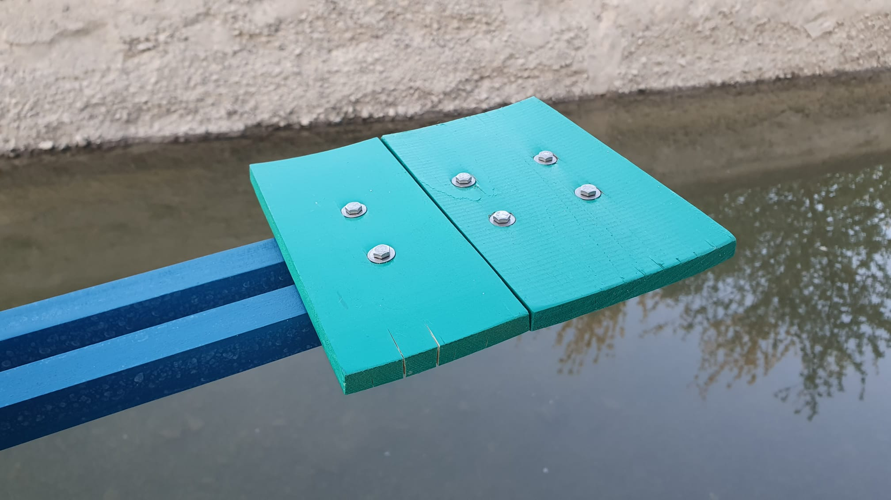
*Trotz Oberflächenbehandlung mit Farbe und Bootslack hat sich das Holz an den Schaufeln nach 2 Wochen (Zählerstand: 50'000 Umdrehungen) in Betrieb gespalten und verzogen.*

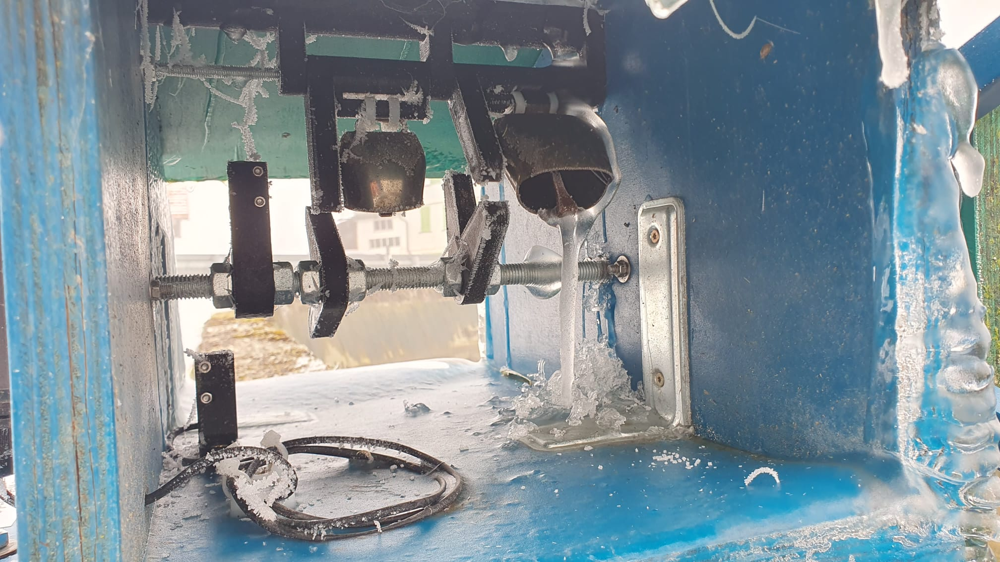
*An Silvester 2024/2025 ist es für einige Tage sehr kalt und neblig gewesen. In dieser Zeit gefror das Wasserrad und drehte deshalb nicht mehr.*

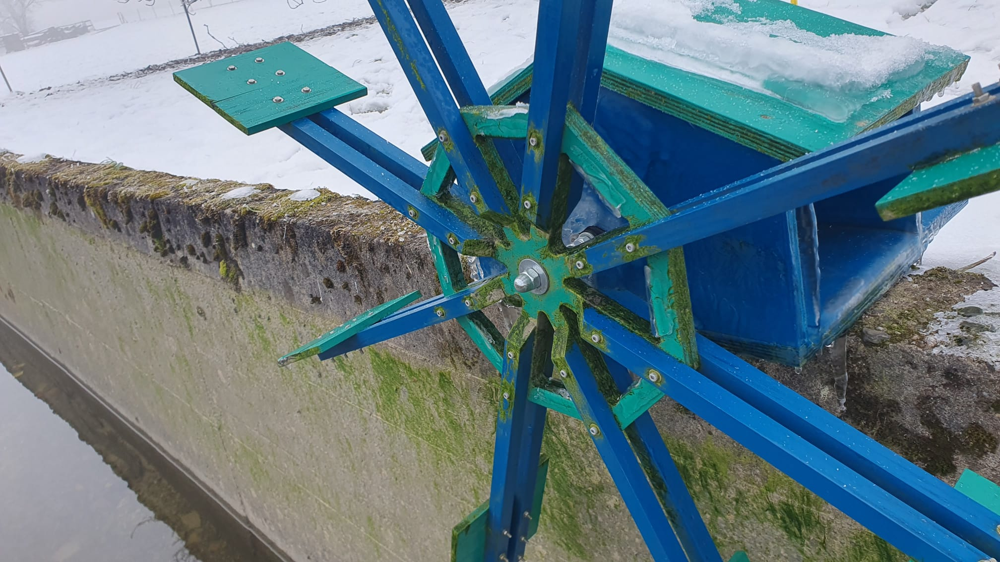
*Im Dezember 2024 hat das Wasserrad bereits mehr als 870'000 Umdrehungen hinter sich. Deutliche Abnutzungs- und Verbrauchsspuren sind sichtbar, und an einigen Stellen hat sich Moos angesetzt.*

## 3. Rundenzähler-Sensor

Um die Drehzahl des Wasserrades zu messen, respektive um zu eruieren, ob der Mühlebach Wasser führt, wird ein LoRaWAN Sensor Node verwendet, an welchem ein Reed-Kontakt (kontaktloser, magnetischer Schalter) angeschlossen ist.

Der Reed-Kontakt schaltet bei jeder Umdrehung des Rades einmal. Der LoRaWAN-Node ([SN50V3-LB LoRaWAN Sensor Node 868MHz](https://www.bastelgarage.ch/lora/lora-sensoren/sn50v3-lb-lorawan-sensor-node-868mhz)) zählt die Schaltungen und sendet diese alle 10 Minuten via Gateway (Empfänger) an einen Server von [The Things Industries](https://www.thethingsindustries.com/), auf welchem die Zählerdaten der letzten 30 Tage gespeichert werden.

Der Reed-Kontakt wird an den Pins `VDD` und `PA8` angeschlossen:

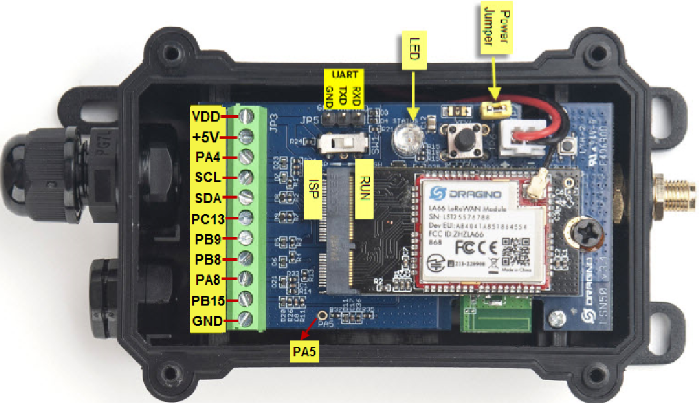  
*Foto von Dragino aus der Anleitung des Nodes SN50v3-LB*

Den Sensor wurde auf [bastelgarage.ch](https://www.bastelgarage.ch/) erworben für CHF 64.90. Die Anleitung gibt es in diesem Repo unter [Docs > datasheet_sensor](./docs/datasheet_sensor/) (Stand März 2024) oder auf der [Webseite des Herstellers](http://wiki.dragino.com/xwiki/bin/view/Main/User%20Manual%20for%20LoRaWAN%20End%20Nodes/SN50v3-LB/).

### 3.1 Dragino SN50v3-LB Sensor konfigurieren

Um den Sensor via Bluetooth zu konfigurieren, muss man die Android-App [Serial Bluetooth Terminal](https://play.google.com/store/apps/details?id=de.kai_morich.serial_bluetooth_terminal) herunterladen. Mit dieser App kann man in einem Terminal den Status des Sensors abfragen sowie die Default-Konfiguration überschreiben.

1. Beim Verbinden muss der AT-PIN eingegeben werden, welchen man auf der Packung des Dragino Sensors findet.
2. Mit dem Befehl `AT+MOD=?` wird der eingestellte Mode zurückgegeben. Standarmässig ist dieser `MOD=1 (Default Mode)`. Mit dem Befehl `AT+MOD=6` kann man den Modus auf "Counting Mode" wechseln. Anschliessend muss man `ATZ` senden, damit der Sensor neu bootet und die Änderungen greifen.
3. Mit dem Befehl `AT+TDC=?` gibt der Sensor seinen Übertragungsintervall an. Dieser ist standardmässig 20 Minuten (1'200'000 ms). Mit `AT+TDC=600000` kann man das Intervall auf 10 Minuten reduzieren.

Mehr Infos zur Konfiguration gibt es in diesem Repo unter [Docs > datasheet_sensor](./docs/datasheet_sensor/) (Stand März 2024). Die aktuelle Konfigurationsanleitung gibt es auf der Webseite des Herstellers: [Dragino Wiki Bluetooth Remote Configure](http://wiki.dragino.com/xwiki/bin/view/Main/BLE%20Bluetooth%20Remote%20Configure/).

### 3.2 The Things Network Cloud

Auf [The Things Industries](https://www.thethingsindustries.com/) kann man sich einen Account anlegen, eine Applikation erstellen und den Sensor eintragen. Er meldes sich anschliessend selbständig an und sendet Daten, welche in der kostenlosen Version von TTN für 30 Tage gespeichert und visualisiert werden.

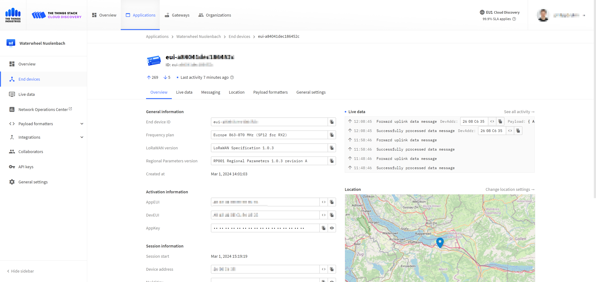

Damit die Rückgabewerte des Sensors lesbar dargestellt werden, kann man unter `Payload formatters` > `Uplink` den JavaScript Code von [hier](./docs/markdown/payload_formater.md) hinterlegen.

Möchte man die Daten einer Webseite zur Verfügung stellen, kann man dies unter `Integrations` > `Storage Integration` tun wie im folgenden Screenshot gezeigt.

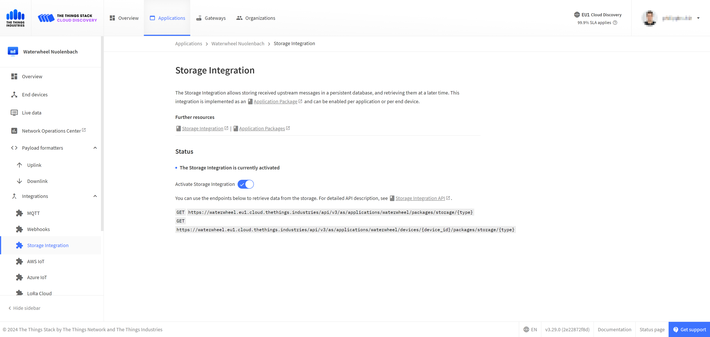

Zusätzlich muss man einen API-Key erstellen, damit die Daten vom TTN Portal abgefragt werden können.

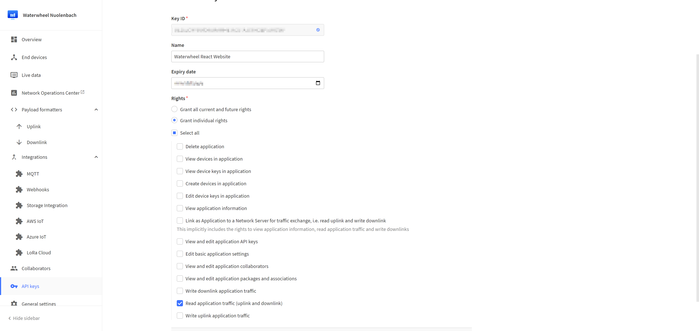

> Achtung, es wird hier keine REST-API zur Verfügung gestellt, sondern ein unendlich langer String mit allen Einträgen, welche man auch auf dem TTN-Portal sieht unter dem Menüpunkt `Live data`. Falls man die Daten auf einer Webseite präsentieren möchte, muss man somit aus dem String zuerst ein Array mit JSON-Objekten erstellen, wobei die Objekte die Messresultate repräsentieren.

Die Sensoreinstellungen können (durch Administratoren von diesem Projekt) unter [waterwheel.console.cloud.thethings.industries](https://waterwheel.console.cloud.thethings.industries/) aktualisiert werden.

> Es scheint, dass das Limit für die Anzahl der Einträge, respektiv die Abfrage der API, Ende August 2024 auf 1'000 Einträge reduziert wurde. Ursprünglich haben wir Abfragen für 7 Tage x 24 Stunden x 6 (alle 10 Minuten) = 1'008 Werte durchgeführt. Jetzt können wir jedoch nur noch 999 Einträge abfragen. Leider wird in der Dokumentation der [Storage Integration API](https://www.thethingsindustries.com/docs/api/reference/grpc/storage_integration/) beim Feld `limit` keine Begrenzung erwähnt.

### 3.3 Empfänger des Sensorsignals (Gateway)

Das vom am Wasserrad montierten Sensor versendete Signal wird gleich von zwei Gateways (anderes Wort für Empfängerantenne) empfangen. Die eine Antenne befindet sich im Leuholz, die andere in der Nähe des Fussballplatzes in Siebnen.

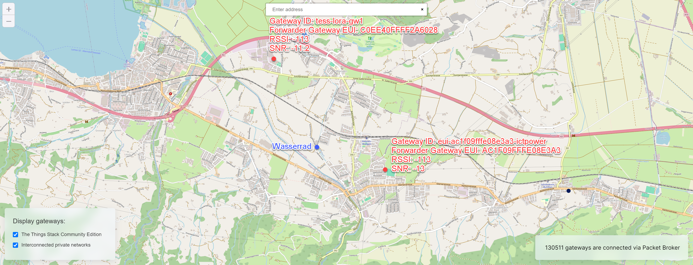

#### Erstes Gateway (Leuholz)

* **Gateway ID**: tess-lora-gw1
* **Forwarder Gateway EUI**: C0EE40FFFF2A6028
* **RSSI**: -113
* **SNR**: -11.2
* **Location**: [47.19409413428462, 8.881038129329683](https://maps.app.goo.gl/YKfhFiJpf1ExT9BF8)
* **Received At**: 2024-06-14T19:54:08.237033511Z

#### Zweites Gateway (Fussballplatz Siebnen)

* **Gateway ID**: eui-ac1f09fffe08e3a3-ictpower
* **Forwarder Gateway EUI**: AC1F09FFFE08E3A3
* **RSSI**: -113
* **SNR**: -13
* **Frequency Offset**: 565
* **Location**: [47.1781551847011, 8.90455267329575](https://maps.app.goo.gl/UmBZAYvzyiBnwe7z6)
* **Received At**: 2024-06-14T19:54:08.236217154Z

### Analyse

* **RSSI (Received Signal Strength Indicator) und SNR (Signal-to-Noise Ratio)**: Beide Gateways haben ähnliche RSSI-Werte (-113), aber leicht unterschiedliche SNR-Werte (-11.2 für das erste Gateway und -13 für das zweite Gateway). Ein höherer SNR-Wert ist besser, da er ein besseres Signal-Rausch-Verhältnis anzeigt.
* **Standort**: Die beiden Gateways befinden sich an unterschiedlichen Standorten, was durch die unterschiedlichen Koordinaten angezeigt wird.
* **Empfangszeit**: Beide Gateways haben die Nachricht nahezu gleichzeitig empfangen.

Die Nachricht vom LoRaWAN Sensor Node des Wasserrades wurde von beiden Gateways empfangen, und beide haben die Nachricht weitergeleitet.

### Bewertung der Empfangssignale

Die Empfangssignale können anhand der RSSI- (Received Signal Strength Indicator) und SNR-Werte (Signal-to-Noise Ratio) beurteilt werden:

#### RSSI

* **-30 dBm bis -90 dBm:** Sehr gutes bis akzeptables Signal.
* **-90 dBm bis -120 dBm:** Schwaches Signal.
* **Weniger als -120 dBm:** Sehr schlechtes Signal, oft zu schwach für zuverlässige Kommunikation.

Die RSSI-Werte von **-113 dBm** fallen in den Bereich eines **schwachen Signals**. Dies deutet darauf hin, dass das empfangene Signal nicht besonders stark ist.

#### SNR

* **Mehr als 10 dB:** Sehr gutes Signal.
* **6 dB bis 10 dB:** Gutes Signal.
* **0 dB bis 6 dB:** Akzeptables Signal.
* **-10 dB bis 0 dB:** Schwaches Signal.
* **Weniger als -10 dB:** Sehr schlechtes Signal.

Ein SNR-Wert von **-11.2 dB** und -13 dB liegt im Bereich eines **sehr schlechten Signals**, was auf ein hohes Mass an Rauschen im Vergleich zum Signal hinweist.

### Verbesserungsmöglichkeiten

Es wäre vorteilhaft, wenn in der Nähe ein weiteres Gateway installiert würde, um die Signalabdeckung und -qualität zu verbessern. Dadurch könnten die Zuverlässigkeit und die Qualität der Datenübertragung erhöht werden.

Welches Gateway letztendlich verwendet wird, hängt von der Netzwerklogik und den Parametern ab, die die TTN-Infrastruktur verwendet, um die beste Nachricht auszuwählen. In der Praxis bedeutet dies, dass beide Gateways erfolgreich als Empfänger fungiert haben und es keine einfache Möglichkeit gibt, zu bestimmen, welches Gateway "primär" verwendet wurde, da dies dynamisch sein kann und von mehreren Faktoren abhängt, einschliesslich der Netzwerklast und der Signalqualität.

Zusätzlich sollte geprüft werden, ob sich der Empfang verbessert, wenn der Sensor etwa einen Meter über dem Boden installiert wird. Der Sensor befindet sich momentan mehr oder weniger auf Bodenniveau, was möglicherweise nicht optimal für die Signalqualität ist.

## 4. Webseite und Online-Quiz

Am Wasserrad gibt es ein QR-Code, welcher auf folgende Quiz-Webseite verweist:

[https://philippbruhin.github.io/wasserrad/](https://philippbruhin.github.io/wasserrad/)

Ohne Programmierkentnisse ist es allenfalls etwas schwierig, die Webseite nachzubauen oder zu erweitern. Das verwendete Template basiert auf [React](https://react.dev/) und [Vite](https://vitejs.dev/). Zudem wurde es mit [Tailwind CSS](https://tailwindcss.com/) erweitert.

Um die Seite lokal auf dem Rechner laufen zu lassen, muss [Node.js](https://nodejs.org/en) in der Version `v20.11.0` installiert sein. Danach kann man folgende Befehle eingeben in der Kommandozeile:

1. Pakete installieren mittels Befehl `npm install`
2. Datei `.env.example` kopieren und zu `.env.local` umbenennen. Enviroment Variabeln von [The Things Stack Cloud Discovery](https://www.thethingsindustries.com/) einfügen.
3. Projekt im Entwicklungsmodus starten via `npm run dev`
4. Produktions-Build erstellen mittels `npm run build`. Achtung, zuvor müssen auch hier noch die Enviroment Variablen gesetzt werden unter "Settings".

Unter [.github/workflows/gh-pages.yml](./.github/workflows/gh-pages.yml) sind die GitHub Actions definiert, um das Projekt automatisch auf den GitHub Pages Server zu deployen.

Neben dem Mühlebach Quiz mit 10 Fragen und Multiple Choice Antworten, gibt es auch Balkendiagramm des Rundenzähler-Sensors.

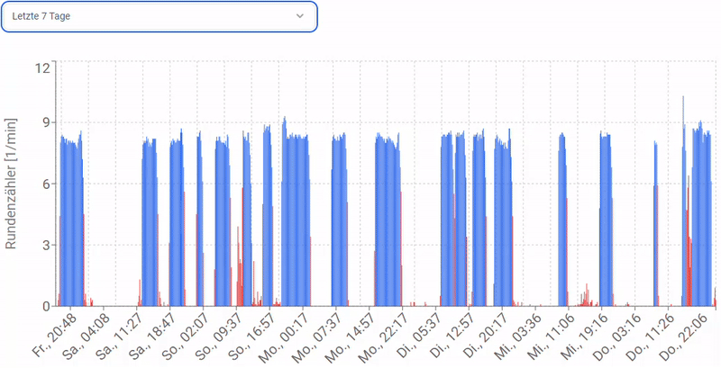
*Angezeigt werden die Umdrehungen der letzten 12 Stunden bis zu den letzten 7 Tagen.*

## 5. Fazit und Ausblick

In diesem Abschnitt wird das Fazit aus den bisherigen Erkenntnissen gezogen und ein Ausblick auf zukünftige Entwicklungen und Verbesserungen des Wasserradprojekts gegeben. Dabei werden wichtige Aspekte wie die Benutzererfahrung, Kosten und weitere potenzielle Optimierungen betrachtet.

* **Errechnete Umdrehungen gegenüber reellen Umdrehungen**  
    Die errechneten Umdrehungen des Wasserrads differieren signifikant von den tatsächlichen Umdrehungen im Betrieb. Bei der Berechnung und Planung der Wasserradumdrehungen ging man vom idealen Wasserrad aus und kam dabei auf 11.3 Umdrehungen pro Minute. Es wurde mit einem Verlust von 10% gerechnet, was aber nicht ausreichte. Es zeigte sich im Betrieb, dass es effektiv nur 8.3 Umdrehungen pro Minute sind.
* **Axiale Belastung Hauptwelle**  
    Die Welle, auf welcher das Wasserrad läuft, basiert auf einer verzinkten M12 Stahl-Gewindestange. Diese ist für die gegebene Länge und die axial auftretende Kraft unterdmiensioniert. Allenfalls müsste ein grösserer Durchmesser oder ein Rohr gewählt werden beim nächsten Mal.
* **Kosten für Material**  
    Es wurden insgesamt 4 Farbspraydosen für je CHF 10.00 gekauft. Dazu kommt eine Dose Bootslack für CHF 14.00, zwei Gleitlager von Contrad Electronic für je CHF 10.00 und der Dragino IoT Sensor für CHF 60.00 sowie der dazugehörige Reed-Kontakt für CHF 10.00. Zusätzlich wurde Holz und Schrauben für ~CHF 50.00 beschafft sowie Werkzeug. Die Materialkosten liegen somit bei über CHF 200.00, was für ein Bastelprojekt dieser Grössenordnung eine ganze Menge ist.
* **Restwasser von Schaufeln tropft auf Dach**  
    Ein Problem mit Tropfwasser auf dem Dach entsteht durch die Positionierung der Schaufeln. Weil die Schaufeln sich auf der einen Seite über dem Dach befinden, tropft konstant Wasser auf das Dach, wenn das Rad läuft. Mögliche Lösungen könnten eine Anpassung der Welle oder des Designs sein, um dieses Problem zu beheben.
* **Einfluss von Wind auf die Drehzahl**  
    Dank der beiden Gleitlager läuft das Wasserrad äusserst leicht. Allerdings kann starker Wind zu unerwünschter Rotation führen, wenn der Bach kein Wasser führt. Dies birgt die Gefahr von Schäden, sollte das Rad zu schnell drehen. Glücklicherweise blieb die Drehzahl in den meisten Fällen bisher unter 5 Umdrehungen pro Minute, selbst bei starken Winden.
* **Quiz zu umfangreich**  
    Nur wenige Besucher nehmen sich die Zeit, um die 10 Fragen zu beantworten. Allenfalls hätte man diese auf ca. 6 Fragen reduzieren müssen. Für jede Frage wird zudem eine Antwort bereitgestellt, egal ob man die Frage falsch oder richtige beantwortet hat. Diese Antworten werden ebenfalls nicht gelesen, obwohl es sich in den meisten Fällen um einen Einzeiler handelt.
* **Wegweiser für Besucher**  
    Das Wasserrad befindet sich fünf Meter abseits der Strasse. Nicht alle Spaziergänger sind zum Wasserrad hingegangen und haben deshalb den QR-Code am Rad-Gehäuse nicht bemerkt. Ein nachträglich intallierter Wegweiser schaffte hierbei Abhilfe. Dank des Wegweisers sind viel mehr Besucher zum Wasserrad hingegnagen, anstatt einfach daran vorbeizulaufen.
